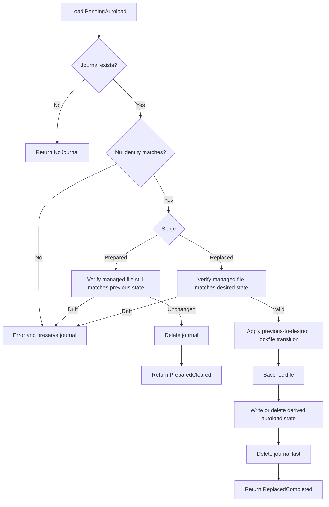

# Autoload Journal Recovery Refactor

Date: 2026-07-12
Status: Approved for implementation planning

## Summary

Centralize module-autoload journal recovery in one command-independent component and run recovery before activation or deactivation target planning. The recovery result must be determined entirely by the persisted `PendingAutoload` transaction, not by whether `numan activate` or `numan deactivate` happens to run next.

This change fixes a correctness defect in the current duplicated recovery paths. The activation-side reconciler can consume a deactivation journal without clearing the deactivated packages' authoritative lockfile activation records. Full-deactivation recovery can delete derived autoload state and the journal while leaving every affected package marked active. Recovery can also be skipped when stale pre-recovery lockfile state causes either command to return before acquiring the mutation lock.

## Goals

- Make `PendingAutoload` recovery command-independent and idempotent.
- Apply the journal's complete previous-to-desired state transition before deleting it.
- Reconcile pending autoload work before target classification and no-op exits.
- Preserve the lockfile as authoritative and `autoload-state.json` as a derived projection.
- Remove duplicated recovery implementations from `activate.rs` and `deactivate.rs`.
- Preserve the existing CLI, journal schema, snapshot boundaries, managed-file ownership checks, and Nu identity rules.

## Non-goals

- Changing the `PendingAutoload` JSON schema or stage model.
- Redesigning plugin activation recovery or `PendingActivation`.
- Redesigning lifecycle journals for install, update, remove, import, or rollback.
- Changing activation or deactivation consent semantics for new work.
- Changing managed-file generation, candidate validation, or atomic replacement.
- Refreshing external architecture documentation such as DeepWiki.

## Current Failure Modes

### Caller-dependent replaced recovery

`src/cmd/activate.rs` and `src/cmd/deactivate.rs` each implement their own `reconcile_autoload_journal` function. Both functions may load either an activation or deactivation journal, but they apply different lockfile transitions.

The activation-side implementation writes activation records for `desired_active_module_ids` but does not clear packages removed by a deactivation journal. When `desired_file_exists` is false, it deletes derived autoload state without clearing any lockfile activation records. It then deletes the journal, removing the evidence needed for a later correct recovery.

### Recovery after target planning

Both commands resolve or classify targets before recovery. A pending journal means the lockfile may intentionally describe the pre-transaction state:

- After an interrupted activation, `deactivate` can reject the package as inactive before recovery marks it active.
- After an interrupted deactivation, `activate` can return `Nothing to activate` before recovery marks the package inactive.

Recovery therefore must happen before target planning, not only inside the later mutation phase.

## Architecture

### Shared recovery component

Add `src/state/autoload_recovery.rs` and export it from `src/state/mod.rs`. It will own the transition from a verified `PendingAutoload` journal to authoritative lockfile state and derived autoload state.

The public interface will be equivalent to:

```rust
pub enum AutoloadRecoveryOutcome {
    NoJournal,
    PreparedCleared,
    ReplacedCompleted,
}

pub fn reconcile_pending_autoload(
    root: &Path,
    nu_paths: &NuPaths,
    lockfile: &mut Lockfile,
) -> Result<AutoloadRecoveryOutcome>;
```

The outcome lets command modules print concise user-facing progress without reimplementing state transitions. Errors retain the journal unless recovery has proven that it is safe to delete.

### Recovery flow



### Applying the authoritative transition

For a verified `Replaced` journal:

1. Treat `previous_active_module_ids` and `desired_active_module_ids` as the transaction boundary.
2. For every desired module, write or reconstruct its `ModuleActivation` using the journal's vendor directory and managed-file path plus the current matching Nu identity.
3. For every previously active module absent from the desired set, clear the matching `module_activation` record.
4. Do not clear unrelated records that were not part of the journal's previous state.
5. Save the lockfile once.
6. If `desired_file_exists` is true, hash the verified managed file and write `AutoloadState` from the desired IDs.
7. If `desired_file_exists` is false, require the desired ID set to be empty and delete `AutoloadState`.
8. Delete `pending-autoload.json` only after every authoritative and derived write succeeds.

Using the previous-to-desired set difference avoids command-specific activation/deactivation branches. `targeted_module_ids` remains transaction metadata and may be checked for consistency, but it is not the source of truth for the final active set.

### Command ordering

Activation and deactivation will use two recovery checkpoints:

1. **Planning checkpoint:** after read-only Nu identity preflight, acquire the mutation lock, reconcile pending journals, reload the lockfile, and resolve or classify targets while the lock is still held. If no targets remain, return while still inside this locked checkpoint. Otherwise, retain the resolved consent information and release the lock before displaying the prompt. Completing an already-consented interrupted transaction does not require new consent.
2. **Mutation checkpoint:** after consent, reacquire the mutation lock, reconcile again, reload the lockfile, and re-resolve targets before creating the new operation's snapshot or writing state. This preserves race safety if another process completed work while the user was considering the prompt.

Resolving the initial targets under the planning lock prevents another Numan process from creating a journal between recovery and a no-op return. The commands must not hold the mutation lock while waiting for interactive input.

`activate` will invoke its existing plugin-journal reconciler, unchanged, at the same two checkpoints so plugin and autoload recovery precede activation planning. `deactivate` remains scoped to module-autoload recovery; changing plugin recovery semantics is outside this refactor.

## Error Handling and Safety

- A stale Nu identity returns an actionable error and preserves the journal.
- Managed-file existence or SHA-256 drift returns an actionable error and preserves the journal.
- Missing package entry metadata, invalid UTF-8 paths, lockfile-save failures, and derived-state failures preserve the journal for idempotent retry.
- Recovery never overwrites or deletes an unverified managed file.
- Clearing an old activation record is limited to IDs recorded in `previous_active_module_ids`, and only when the record matches the journal's Nu hash, Nu version, vendor directory, and managed-file path. Unrelated or newly retargeted package records are untouched.
- Journal deletion remains the final commit marker.
- Recovery runs only while holding `acquire_mutation_lock(root)`.
- Existing pre-mutation snapshot IDs remain attached to the journal; recovery does not create a second snapshot for the same interrupted transaction.

## Test Strategy

Implementation follows red-green-refactor. Each regression test must fail for the expected current behavior before production code changes.

### Shared recovery tests

- A `Replaced` activation journal writes all desired activation records and derived state.
- A `Replaced` partial-deactivation journal clears the previous-minus-desired records and preserves desired records.
- A `Replaced` full-deactivation journal clears all previous records and deletes derived state.
- A `Prepared` journal with unchanged external state is safely cleared.
- A `Prepared` journal with file drift is preserved and returns an error.
- A `Replaced` journal with missing or mismatched managed-file state is preserved.
- A journal with a stale Nu identity is preserved.
- Missing entry metadata or lockfile persistence failure leaves the journal available for retry.
- Re-running recovery after an interrupted derived-state write is idempotent.

### Command integration tests

- `deactivate` recovers an interrupted activation before deciding whether the requested module is active.
- `activate` recovers an interrupted partial deactivation before deciding whether the requested module needs activation.
- `activate` recovers an interrupted full deactivation without leaving stale lockfile activation records.
- A no-journal, no-target invocation retains the existing `Nothing to ...` behavior.
- Tests use `FakeCandidateRunner` and injectable registrars; unit and integration tests do not spawn a real Nu binary.

### Verification gates

- Targeted recovery and module-autoload tests.
- `cargo test`.
- `cargo clippy -- -D warnings`.
- `cargo fmt --check`.

## Documentation and Structure

Update `AGENTS.md` only if the new recovery module changes the documented project structure or conventions. No user-facing command documentation should change because the CLI and intended recovery contract remain stable.

## Acceptance Criteria

- Activation and deactivation call one shared autoload recovery implementation.
- Recovery produces the same final state regardless of which command runs next.
- A deactivation journal recovered through `activate` cannot leave removed packages marked active.
- An activation journal recovered through `deactivate` is applied before active-target validation.
- No pending journal is skipped solely because pre-recovery target resolution found no work.
- Failed recovery preserves the journal and returns an actionable error.
- Successful recovery leaves the lockfile, managed file, and derived autoload state mutually consistent.
- All repository CI gates pass.
